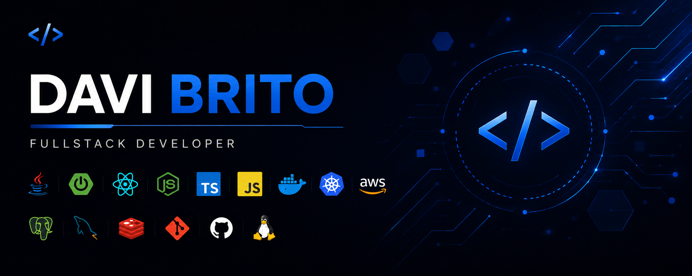

  

---

# Hey! Welcome
Fullstack Developer and IT Analyst focused on backend engineering, infrastructure and scalable software solutions.

Professional experience with:
- enterprise technical support
- Windows Server administration
- SQL/MySQL database environments
- software troubleshooting and integrations
- REST APIs and backend systems
- technical documentation and requirements analysis
- infrastructure and cloud-based environments

Currently focused on the Fullstack ecosystem, building scalable applications and documenting software engineering studies through practical repositories and technical notes.

---

# Technologies & Skills

 

| Area | Technologies & Knowledge |
|---|---|
| Backend | Java, Spring Boot, Node.js, REST APIs |
| Frontend | React.js, Next.js, TypeScript |
| Database | MySQL, PostgreSQL, SQL Server |
| Infrastructure | Windows Server, Networks, Office 365 |
| Cloud | AWS, Backup Environments |
| Processes | Technical Documentation, Requirements Analysis, Project Management |

---

# Technical Documentation & Study Repositories

## Backend Engineering
Java, Spring Boot, APIs, Authentication, Architecture, Software Patterns and Microservices.

➡️ https://github.com/daviribrito/tech-notes/tree/main/backend

---

## Frontend Engineering
React, Next.js, UI architecture, reusable components and frontend structure.

➡️ https://github.com/daviribrito/tech-notes/tree/main/frontend

---

## Database
SQL, PostgreSQL, MySQL, SQL Server, modeling, indexing and performance optimization.

➡️ https://github.com/daviribrito/tech-notes/tree/main/database

---

## Infrastructure & Cloud
Docker, Linux, Windows Server, deployments, AWS and DevOps concepts.

➡️ https://github.com/daviribrito/tech-notes/tree/main/infra-cloud

---

# Professional Experience

| Company | Role | Period |
|---|---|---|
| Mercado Eletrônico | Support Analyst Jr. | 2025 - Present |
| Mercado Eletrônico | Technical Support | 2024 - 2025 |
| Carla Amorim | Support Assistant | 2023 - 2024 |
| Carla Amorim | IT Intern | 2022 - 2023 |

---

# Education & Certifications

### Higher Education
- Information Technology Management — Cruzeiro do Sul University
- Systems Development Technician — ETEC

### Additional Courses & Certifications

#### FIAP ON
- Leadership Communication
- Big Data & Analytics
- Business Intelligence (BI)
- Cloud Fundamentals
- Artificial Intelligence & Computational Intelligence
- Blockchain Advanced

#### Fundação Bradesco
- IT Systems Projects
- Data Modeling
- Database Implementation
- Database Administration

#### Alura
- SQL Server 2022 — Advanced Queries
---

## GitHub Stats

  

  

---

# Contribution Streak

